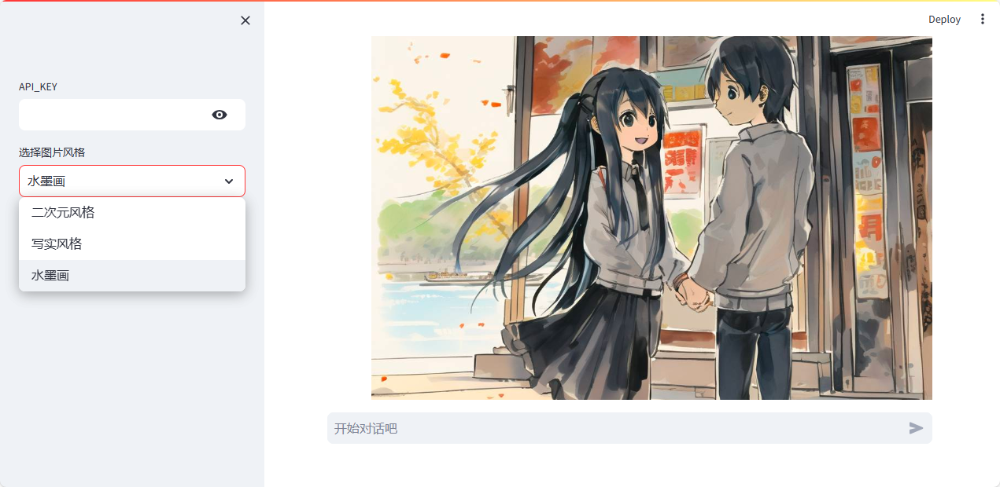
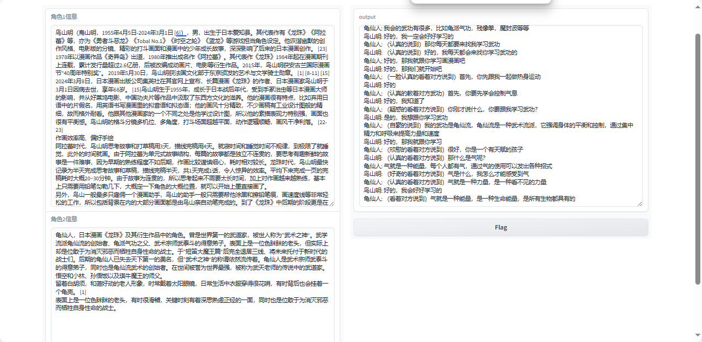

# 作业一

改进 characterglm_api_demo_streamlit.py 的代码，为文生图功能加上风格选项，并在页面上加一个可指定图片风格的选项框。




# 作业二

实现 role-play 对话数据生成工具，要求包含下列功能：

基于一段文本（自己找一段文本，复制到提示词就可以了，比如你可以从小说中选取一部分文本，注意文本要用 markdown 格式）生成角色人设，可借助 ChatGLM 实现。
给定两个角色的人设，调用 CharacterGLM 交替生成他们的回复。
将生成的对话数据保存到文件中。
（可选）设计图形界面，通过点击图形界面上的按钮执行对话数据生成，并展示对话数据。

完成情况说明：
1、在api.py中新增了函数，用生成2个角色的角色名和人设。
```python
def generate_role_NameandInfo(role_profile: str) -> Generator[str, None, None]:
    """ 用chatglm根据文本生成角色的名和人设 """
    
    instruction = f"""
请从下列文本中，抽取出所描写对象的角色名；并抽取出其角色人设信息,不超过200字。以下面格式返回。如
{{
    "name": "鲁迅",
    "info": "浙江绍兴人。他是一位著名文学家、思想家、革命家、教育家、民主战士，是新文化运动的重要参与者，也是中国现代文学的奠基人之一"
}}
文本：
{role_profile}
"""
    return get_chatglm_response_via_sdk(
        messages=[
            {
                "role": "user",
                "content": instruction.strip()
            }
        ]
    )
```

2、交替进行自动会话，程序里设置参数为20轮。


3、会话保存在characterGLM\dialogue.txt

4、使用gradio提供了可视化操作页面，点击flag可用保存会话内容。